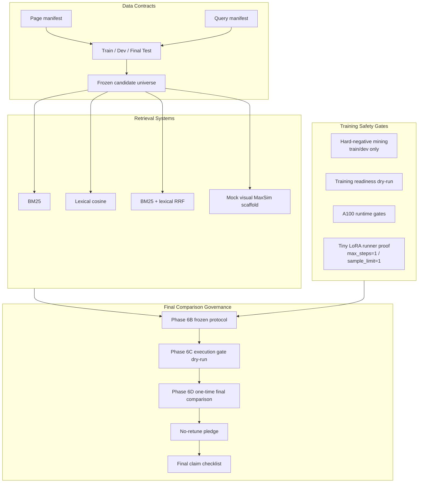

中文

# VisDoc-Retrieve

[](https://www.python.org/downloads/)
[](https://github.com/astral-sh/ruff)
[](openspec/)
[](https://github.com/Raidriar7170/visdoc-late-interaction-retrieval/releases/tag/v0.1.0)

**一个页面级多模态文档检索评测项目：从数据清单、候选集冻结、文本基线、mock visual
MaxSim 脚手架、hard-negative mining、训练门禁，到冻结协议下的一次性 final
comparison。**

---

## 一句话总结

> VisDoc-Retrieve 完成了一个 evidence-driven 的文档检索评测工程闭环。它没有声称
> benchmark improvement，而是展示如何把检索实验做成可复现、可审计、可防止
> final-test 调参的完整流程。

`v0.1.0 released` · `one-time final comparison complete` ·
`no-retune pledge active` · `claim_status=no_clear_improvement_claim`

---

## 为什么需要这个项目

视觉丰富的 PDF、扫描件、技术报告和页面截图里，经常同时存在 OCR 文本、布局、表格、
图像区域和视觉线索。一个严谨的检索项目不能只给出“模型更好”的结论，还需要回答：

| 问题 | VisDoc-Retrieve 的处理方式 |
| --- | --- |
| 数据 split 是否清晰？ | 页面和 query manifest 显式记录 train/dev/test。 |
| 候选集是否稳定？ | candidate universe 在评测前冻结。 |
| baseline 是否可复现？ | BM25、lexical cosine、RRF 均为确定性 CPU 路径。 |
| visual path 是否被夸大？ | `mock_visual` 明确标注为 MaxSim scaffold，不是真实视觉模型。 |
| 训练和 adapter 是否安全？ | A100/tiny runner 只作为 pipeline evidence，不作为 benchmark gain。 |
| final test 后是否还能调参？ | Phase 6D 后 no-retune pledge 生效。 |

---

## 项目完成了什么

### 1. 数据与评测契约

- 构建 synthetic smoke corpus、page/query manifests 和 split-aware 数据清单。
- 固定 `evaluated_split_pages` candidate universe。
- 明确 Recall@1、Recall@5、MRR、NDCG@10 和 support count 等指标。

### 2. 可复现检索基线

- `bm25`
- `lexical_cosine`
- `bm25_lexical_rrf`
- deterministic `mock_visual` MaxSim scaffold

这些路径都能在本地 CPU 环境运行，不依赖 GPU、网络、模型下载或私有配置。

### 3. 训练与视觉后端门禁

- hard-negative mining 只使用 train/dev，不读取 final test。
- training readiness / pilot launcher 默认 fail closed。
- A100 runtime、model path、optional dependency、tiny LoRA runner 都被记录为 evidence。
- `max_steps=1` / `sample_limit=1` tiny runner proof 只证明链路可运行，不代表训练收益。

### 4. Final benchmark governance

- Phase 6B 冻结 final-comparison protocol。
- Phase 6C 生成 final-run dry-run gate 和 readiness report。
- Phase 6D 执行一次 one-time frozen final comparison。
- 记录 run manifest、protocol/data/config hash、final metrics、claim checklist 和
  no-retune pledge。

---

## 最终结果与边界

Phase 6D 已完成一次性 frozen final comparison。final test split 已在该授权 run 中读取
一次；读取后不再允许调参、修改 retrieval pipeline、修改 metric definitions、修改
candidate universe、修改 final labels，或基于结果重跑刷分。

### Final systems

| System | Status | Recall@1 | Recall@5 | MRR | NDCG@10 | 说明 |
| --- | --- | ---: | ---: | ---: | ---: | --- |
| `bm25` | final_benchmark | 0.667 | 0.917 | 0.769 | 0.824 | 确定性文本基线 |
| `lexical_cosine` | final_benchmark | 0.667 | 0.917 | 0.775 | 0.829 | 确定性 lexical cosine |
| `bm25_lexical_rrf` | final_benchmark | 0.667 | 0.875 | 0.772 | 0.826 | 文本 RRF fusion |
| `mock_visual` | final_benchmark | 0.125 | 0.500 | 0.337 | 0.491 | deterministic MaxSim scaffold |
| `tiny_lora_adapter` | not_available | - | - | - | - | 无 committed adapter checkpoint |
| `zero_shot_visual_backend` | not_available | - | - | - | - | 无真实视觉 backend 指标 |

### Claim boundary

最终 claim checklist 记录：

- `benchmark_claim_allowed=false`
- `claim_status=no_clear_improvement_claim`

因此这个项目**不能**写成“模型性能提升 X%”或“视觉模型超过文本 baseline”。更准确的结论是：

> 项目完成了一个严谨、可复现、可审计的文档检索评测系统；最终结果没有支持明确的
> benchmark improvement claim，但完整保留了真实评测边界和 unavailable-system 状态。

---

## 系统架构



---

## 快速开始

### 安装

```bash
git clone https://github.com/Raidriar7170/visdoc-late-interaction-retrieval.git
cd visdoc-late-interaction-retrieval
python -m pip install -e .
```

### 运行诊断 MVP

```bash
PYTHONPATH=src python -m visdoc_retrieve.run_mvp --config configs/mvp.json
```

输出：

- `reports/mvp/metrics.json`
- `reports/mvp/rankings.csv`
- `reports/mvp/mock-visual-embeddings.json`
- `reports/mvp/run-card.md`

### 运行 hard-negative mining

```bash
PYTHONPATH=src python -m visdoc_retrieve.mine_hard_negatives \
  --config configs/hard_negatives.json
```

### 运行训练 dry-run

```bash
PYTHONPATH=src python -m visdoc_retrieve.train_lora_dry_run \
  --config configs/train_lora_dry_run.json
```

### 本地验证

```bash
pytest -q
ruff check .
mypy src
openspec validate --all --strict
```

---

## 评测方法论

### 1. Split discipline

MVP、hard-negative mining、training readiness 和 dev-only harness 都避免读取 final
test。final test 只在 Phase 6D 的 one-time frozen final comparison 中读取一次。

### 2. Frozen protocol

final comparison 之前冻结：

- split policy
- candidate universe
- metric definitions
- planned systems
- claim checklist
- no-tuning-after-final rule

### 3. Unavailable systems 不造假

如果系统没有冻结 artifact 或可评估 backend，就写成 `not_available`，不补假指标。

最终不可用系统：

- `tiny_lora_adapter`
- `zero_shot_visual_backend`

### 4. Scaffold 不冒充模型性能

`mock_visual` 用于验证视觉 late-interaction / MaxSim 管线形状，是 deterministic CPU-only
scaffold，不是 ColPali、ColQwen 或其他真实视觉模型结果。

---

## Evidence Map

| Evidence | Path |
| --- | --- |
| Evidence index | [`docs/evidence-index.md`](docs/evidence-index.md) |
| Project card | [`docs/project-card.md`](docs/project-card.md) |
| Resume bullets | [`docs/resume-bullets.md`](docs/resume-bullets.md) |
| Interview talking points | [`docs/interview-talking-points.md`](docs/interview-talking-points.md) |
| Final protocol | [`docs/final-comparison-protocol.md`](docs/final-comparison-protocol.md) |
| Final report | [`reports/final-comparison/final-comparison-report.md`](reports/final-comparison/final-comparison-report.md) |
| Final metrics | [`reports/final-comparison/final-metrics.json`](reports/final-comparison/final-metrics.json) |
| Final rankings | [`reports/final-comparison/final-rankings.csv`](reports/final-comparison/final-rankings.csv) |
| Claim checklist | [`reports/final-comparison/final-claim-checklist.json`](reports/final-comparison/final-claim-checklist.json) |
| No-retune pledge | [`reports/final-comparison/no-retune-pledge.md`](reports/final-comparison/no-retune-pledge.md) |
| v0.1.0 release notes | [`docs/release/v0.1.0-release-notes.md`](docs/release/v0.1.0-release-notes.md) |

---

## 如何展示这个项目

适合写成：

- 文档检索 / 多模态检索评测项目
- evidence-driven benchmark harness
- final-test governance / no-retune workflow
- retrieval baseline + evaluation protocol engineering
- honest research-engineering case study

不适合写成：

- 生产级 RAG 系统
- 真实视觉模型 benchmark
- LoRA adapter 性能提升项目
- 已证明超过 baseline 的模型结果
- 基于 final test 调参得到的 leaderboard 项目

---

## v0.1.0 Release

`v0.1.0` 是当前完成版 GitHub snapshot：

- Release: <https://github.com/Raidriar7170/visdoc-late-interaction-retrieval/releases/tag/v0.1.0>
- Changelog: [`CHANGELOG.md`](CHANGELOG.md)
- Release notes: [`docs/release/v0.1.0-release-notes.md`](docs/release/v0.1.0-release-notes.md)

这个 release 适合作为 portfolio / recruiting / research-engineering 展示材料。它不是部署包，
也不是 benchmark improvement claim。
